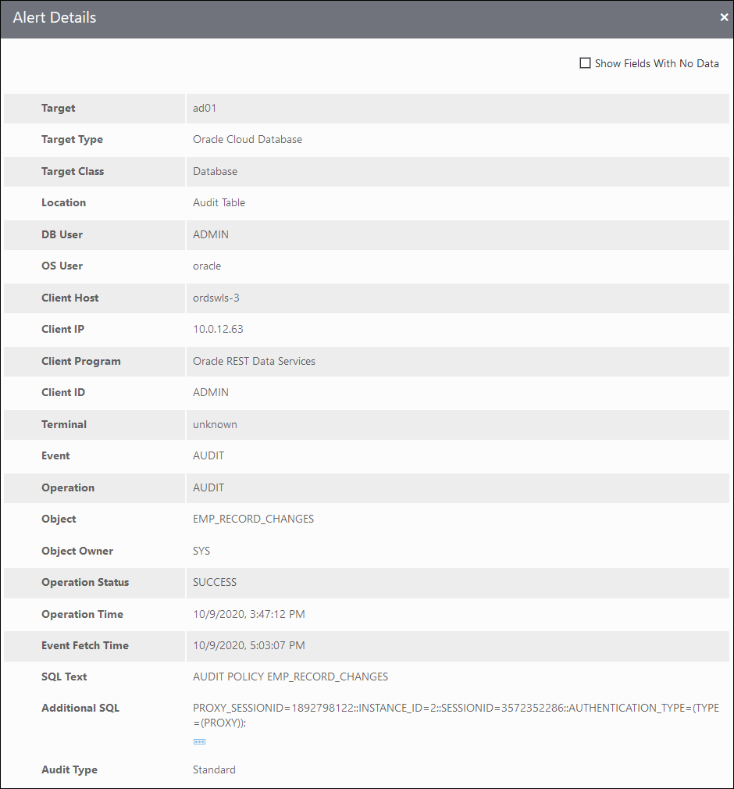
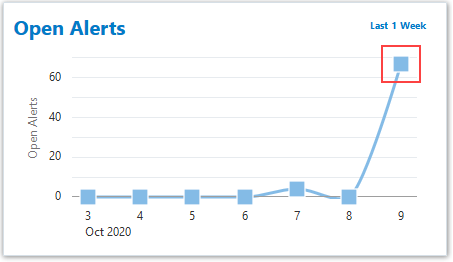
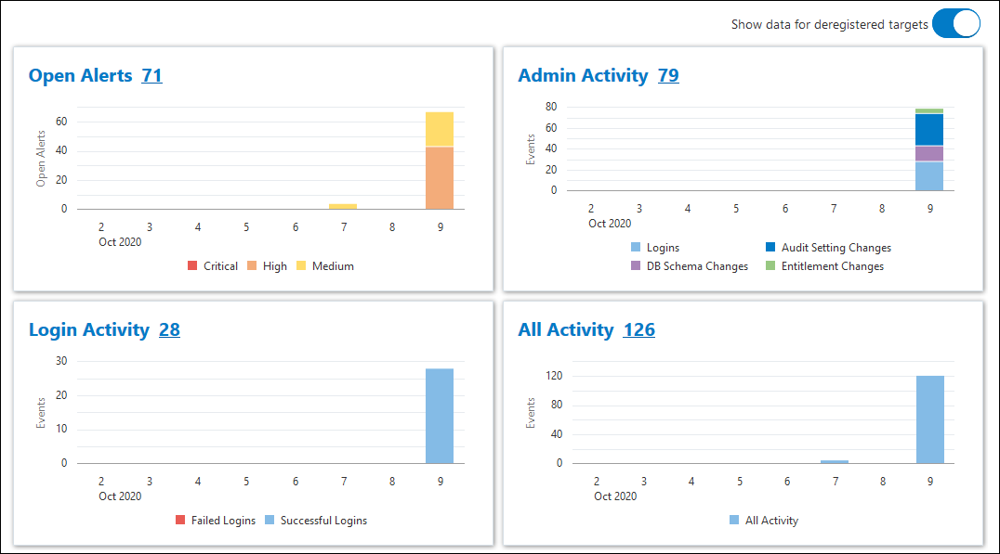
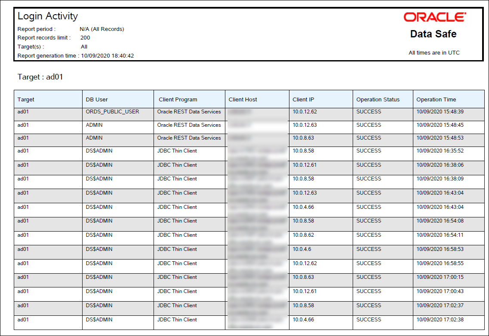

# Analyze Alerts and Audit Reports

## Introduction
This lab shows you how to view and analyze alerts, and audit data on your Autonomous Database with Oracle Data Safe.

Estimated Lab Time: 30 minutes

### Objectives

In this lab, you'll:

- Sign in to the Oracle Data Safe Console
- View and close alerts
- Analyze open alerts from the dashboard
- View all audit records for the past week
- View a summary of audit events collected and alerts raised
- Create a logins report

### Prerequisites

To complete this lab, you need to have the following:

- An Oracle Cloud account
- Access to an Autonomous Database, sample data for Oracle Data Safe loaded into the database, and the Activity Auditing feature enabled on the database
- Access to an Oracle Data Safe service
- Privileges to use the Activity Auditing feature on your database
- Audit collection started on your target database in Oracle Data Safe.

### Assumptions

This lab assumes the following:

- You have a browser tab signed in to the Oracle Cloud Infrastructure Console. If not, please refer to the [Prerequisites](?lab=prerequisites) for this workshop.

- You completed the following labs in this workshop:

    - [Provision and Register an Autonomous Database](?lab=lab-1-provision-register-autonomous)
    - [Provision Audit and Alert Policies](?lab=lab-2-provision-audit-alert-policies)

- Your data values will be different than those shown in the screenshots in this lab.

## **STEP 1**: Sign in to the Oracle Data Safe Console

1. If you are already signed in to the Oracle Data Safe Console, click the **Oracle Data Safe** tab in your browser.

2. If you are not signed in to the Oracle Data Safe Console, do the following:

    a) Click the browser tab named **Oracle Cloud Infrastructure**, and sign in to the Console if needed.

    b) From the navigation menu, select **Data Safe**. The **Overview** page for the Oracle Data Safe service is displayed.

    c) Click **Service Console**. The **Home** tab in the Oracle Data Safe Console is displayed.

## **STEP 2**: View and close alerts

1. In Oracle Data Safe Console, click the **Alerts** tab.

2. View the total number of target databases, critical risk alerts, high risk alerts, medium risk alerts, open alerts, and closed alerts. At a glance, you can better understand whether the security of your database is in jeopardy and how you should prioritize your work.

  

3. Scroll down to review the alerts in the table.

  - The **DB User** column identifies who is doing the action.

  - The **Operation** column identifies the action.

  - The **Alert Severity** column indicates the seriousness of the action.

  

4. At the bottom of the page, click the page numbers to view other pages of alerts.

5. To filter the report to show only open high alerts, at the top of the report, click **+ Filter** and then set the filter to be: **Alert Severity = High**. Click **Apply**.

   - If the filters are not displayed, click **Filters** below the totals at the top of the page.

  - Leave the default filters on **Alert Status** and **Operation Time** set as is.

  

  The table shows you the open high alerts.

6. To sort the **Operation** column, position the cursor over the **Operation** column heading, and then click the arrow button.

 

7. To view more detail for an alert, click the alert ID.

 

8. Review the information in the **Alert Details** dialog box, and then click **X** to close it. You can view the **DB User**, **Operation Status**, **SQL Text**, and much more.

   

9. To remove the filters, click the **X** next to each filter, and then click **Apply**.

10. To create a filter to view the list of alerts for user entitlement changes, do the following:

  a) Click **+ Filter**.

  b) Set the filter to be: **Alert = User Entitlement Changes**.

  c) Click **Apply**.

11. Review the alerts.

  

12. Suppose you are fine with these entitlement changes. Now you can close the alerts.

    a) Select the check box in the top left corner of the table to select all of the alerts displayed.

    b) From the **Mark As** menu, select **Closed**. The alerts selected on this page are closed.

    

13. To hide closed alerts, move the **Open Alerts only** slider to the right.

    

## **STEP 3**: Analyze open alerts from the dashboard

1. Click the **Home** tab.

2. In the **Open Alerts** chart, notice that the chart shows the number of open alerts for the last 7 days. Click the last node in the chart.

      

3. In the **Open Alerts** dialog box, view the number of open alerts for the last 7 days.

    

4. Hover over the counts to view the number of **Critical**, **High**, and **Medium** alerts for each day.

5. Click the name of your target database to open the **All Alerts** report. The **All Alerts** report is filtered to show only the open alerts for your target database for the past 7 days.

    

## **STEP 4**: View all audit records for the past week

1. Click the **Reports** tab.

2. On the left, under **Activity Auditing**, click the **All Activity** report.

3. At the top of the report, view the totals for **Targets**, **DB Users**, **Client Hosts**, **Login Success**, **Login Failures**, **User Changes**, **Privilege Changes**, **DDLs**, **DMLs**, and **Total Events**.

    

4. Review the data in the table. The report is automatically filtered to show one week's worth of audit data for your target database. If the filter is not displayed, click **Filters**.

     

## **STEP 5**: View a summary of audit events collected and alerts raised

1. On the left, expand **Summary**, and then click **Audit Summary**.

    - The **Audit Summary** report helps you to gain an understanding of the activity trends of your target databases. By default, the report shows you data for all of your target databases for the past week.

2. View the totals to learn how many target databases are represented in the charts, how many users are audited, and how many client hosts have connected to your target database. The report is filtered to show data for the last week.

      

3. Review the charts.

  - The **Open Alerts** chart compares the number of critical, high, and medium open alerts for the past week.

  - The **Admin Activity** chart compares the number of logins, database schema changes, audit setting changes, and entitlement changes for the past week.

  - The **Login Activity** chart compares the number of failed and successful logins for the past week.

  - The **All Activity** chart compares the total number of events for the past week.

     

4. To filter the time period for the report, at the top, select **Last 1 Month**, and then click **Apply**.

5. To filter the target database for the report, do the following:

    a) In the **Filters** section, click **All Targets**.

    b) In the **Select Targets** dialog box, deselect the check box for **All Targets**, click the field, select your target database, and then click **Done**.

    c) Click **Apply**. Your target database is now set as a filter.

    

## **STEP 6**: Create a logins report

1. Click the **Reports** tab.

2. To view the **Login Activity** report, in the list under **Activity Auditing**, click **Login Activity**.

3. From the **Report Definition** menu, select **Save As New**.

4. In the **Save As** dialog box, enter the report name **<user name> Logins**, enter the description **Logins report**, select your compartment, and then click **Save As**. A confirmation message states that the report is successfully created.

5. Click the **Reports** tab.

6. At the top of the list under **Custom Reports**, click your **Logins** report.

      

7. Click **Generate Report**.

8. In the **Generate Report** dialog box, leave **PDF** selected, select your compartment, and then click **Generate Report**.

9. Wait for a confirmation message that states that the **Report was generated successfully**.

10. Click the **Download Report** link.  The **Opening Logins.pdf** dialog box is displayed.

11. Select the application with which you want to open the PDF, and click **OK**.

12. Review the report, and then close it.

  

Continue to the next lab, [Assess Database Configurations and Users](?lab=lab-4-assess-database-configurations).

## Learn More

* [Activity Auditing Reports](https://docs.cloud.oracle.com/en-us/iaas/data-safe/doc/activity-auditing-reports.html)
* [Manage Alerts](https://docs.cloud.oracle.com/en-us/iaas/data-safe/doc/manage-alerts.html)

## Acknowledgements
* **Author** - Jody Glover, Principal User Assistance Developer, Database Development
* **Last Updated By/Date** - Jody Glover, October 15, 2020

## See an issue?
  Please submit feedback using this [form](https://apexapps.oracle.com/pls/apex/f?p=133:1:::::P1_FEEDBACK:1). Please include the *workshop name*, *lab* and *step* in your request.  If you don't see the workshop name listed, please enter it manually. If you would like for us to follow up with you, enter your email in the *Feedback Comments* section.
