# Protect Sensitive Data (Label Security)

## Introduction
Oracle Label Security uses row level data classifications to enforce access controls restricting users to only the data they are allowed to access. It enables organizations to control their operational and storage costs by enabling data with different levels of sensitivity to co-mingle within the same database. Oracle Label Security also provides a cost-efficient way to address regulatory requirements for managing access to data on a need to know basis.

In the first activity below we will be demonstrating how Label Security could help customers to track consent and enforce restriction of processing based on OLS Levels and Groups. For that, we simulate that we have 4 applications.

Under GDPR there is the need to collect explicit consent from users, on how their data can be processed. There is the need to track consent. Based on granted consent, users/customers expect that their data is processed just for the purposes they have granted consent. This is known, under GDPR, “enforce restriction of processing”.

The second activity will use the Glassfish HR application and protect it with Oracle Label Security. It will make small modifications to the application's JSP files to set the user session during login.

*Estimated Lab Time*: 30 minutes

### Objectives
- The objective of this lab is to provide guidance on how Oracle Label Security could be used to help tracking consent and enforce restriction of processing under the General Data Protection Regulation requirements. Different OLS strategies could be taken to achieve similar functionality. The details provided here are merely to serve as an example.

### Prerequisites
This lab assumes you have:
- A Free Tier, Paid or LiveLabs Oracle Cloud account
- SSH Private Key to access the host via SSH
- You have completed:
    - Lab: Generate SSH Keys
    - Lab: Prepare Setup
    - Lab: Environment Setup
    - Lab: Oracle Database Vault

## **STEP 1**: Simple CRM Application

### Different applications have different purposes:

**User App:** Application where users sets their preferences for consent to marketing, processing data or asks to be forgotten. Runs with User Label: NCNST::DP – Uses Database user: APPPREFERENCE.

**Email Marketing:** Application that can only access users that have consented to process their data and specifically for email marketing. Runs with User Label: CONS::EMAIL – Uses Database user: APPMKT.

**Business Intelligence:** Application that can access all users who have consented to process their data. Runs with User Label: CONS::DP – Uses Database user: APPBI.

**Anonymizer:** Batch process to anonmyize user records and set the data label to ANON::. Runs with User Label: FORGET:: - Uses Database user: APPFORGET.

### How to walk through the lab

While we provide scripts to execute the whole lab from start to finish in an automated fashion, it is strongly recommended that you open one by one and copy/execute the code blocks one by one. This way you’ll get a better understanding of the building blocks of this exercise. In case you decide to execute script by script, you can always review the log files (.out) for the details.

1. Open a SSH session on your DBSec-Lab VM as Oracle User

      ````
      <copy>sudo su - oracle</copy>
      ````

2. Go to the scripts directory

      ````
      <copy>cd $DBSEC_HOME/workshops/Database_Security_Labs/Label_Security/Simple_CRM_App</copy>
      ````

3. First, you must setup the Label Security environment

      ````
      <copy>./01_setup_ols_environment.sh</copy>
      ````

   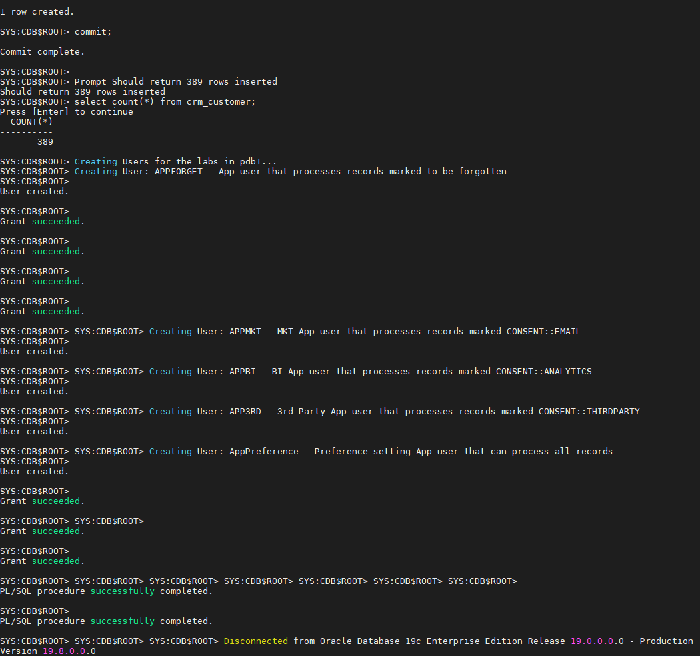

   For each step, you can review the output of the script that you executed. For example

   ````
   <copy> more 01_setup_ols_environment.out</copy>
   ````

  **Note:**

  -  This script creates c##oscar_ols user, creates a table, loads data, creates users that will be used to showcase difference scenarios. It also configures and enables OLS.
  -  This sql script invoke *`load_crm_customer_data.sql`* script to create the table *`CRM_CUSTOMER`* in *`APPCRM`* schema and inserts 389 rows.

4. Next, you create the Label Security policy.
   A policy consists of  levels, groups and/or compartments. The only mandatory component of a policy is at least one level.

      ````
      <copy>./02_create_ols_policy.sh</copy>
      ````

   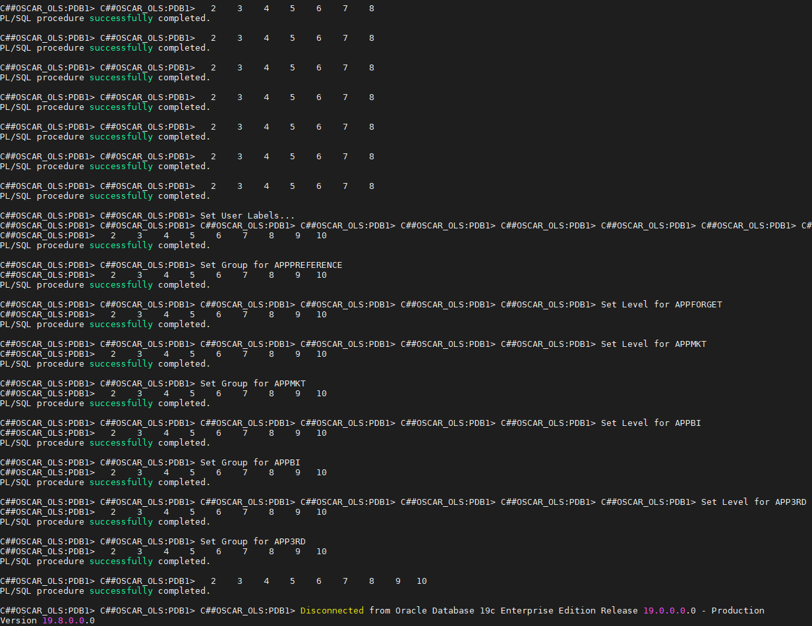

   **Note:** This script will create Policy (Levels, Groups, and Labels), set Levels and Groups for Users, and apply the Policy to the `APPCRM.CRM_CUSTOMER` table

 5. Then, we must label the data.
    We use the policy we created and apply one level and optionally, one or more compartments and, optionally, one or more groups.

   ````
   <copy>./03_label_data.sh</copy>
   ````


   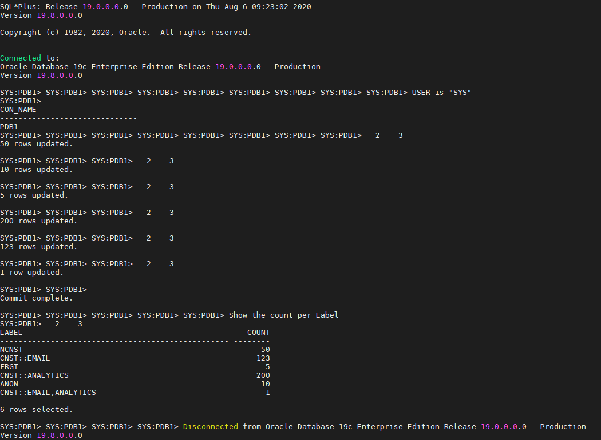

   **Note:** This script update data labels to create some diversity of labels that will be used in the scenarios. In real world scenarios would be advisable to create a labeling function that would assign labels based on other existing table data (other columns).

6. Then we will see the label security in action

      ````
      <copy>./04_label_sec_in_action.sh</copy>
      ````

   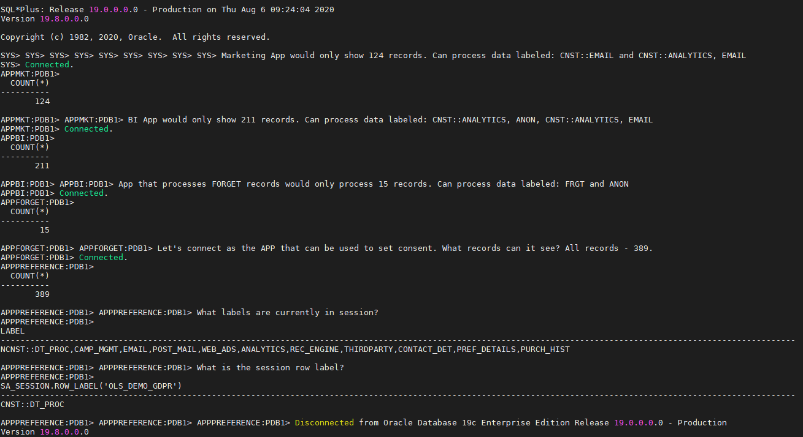

   **Note:** This script connects as different apps would be connecting. Each App would only see records that they would be able to process. E.g. AppMKT (app that is used for emailing customers) would only be able to see records labeled as CNST::EMAIL; AppBI would be able to see records labeled as ANON, and CNST::ANALYTICS (rows labeled with level CNST, and part of Group Analytics – would work for CNST::ANALYTICS,EMAIL as well.)

7. Now, we change users status to be forgotten

      ````
      <copy>./05_to_be_forgotten.sh</copy>
      ````

   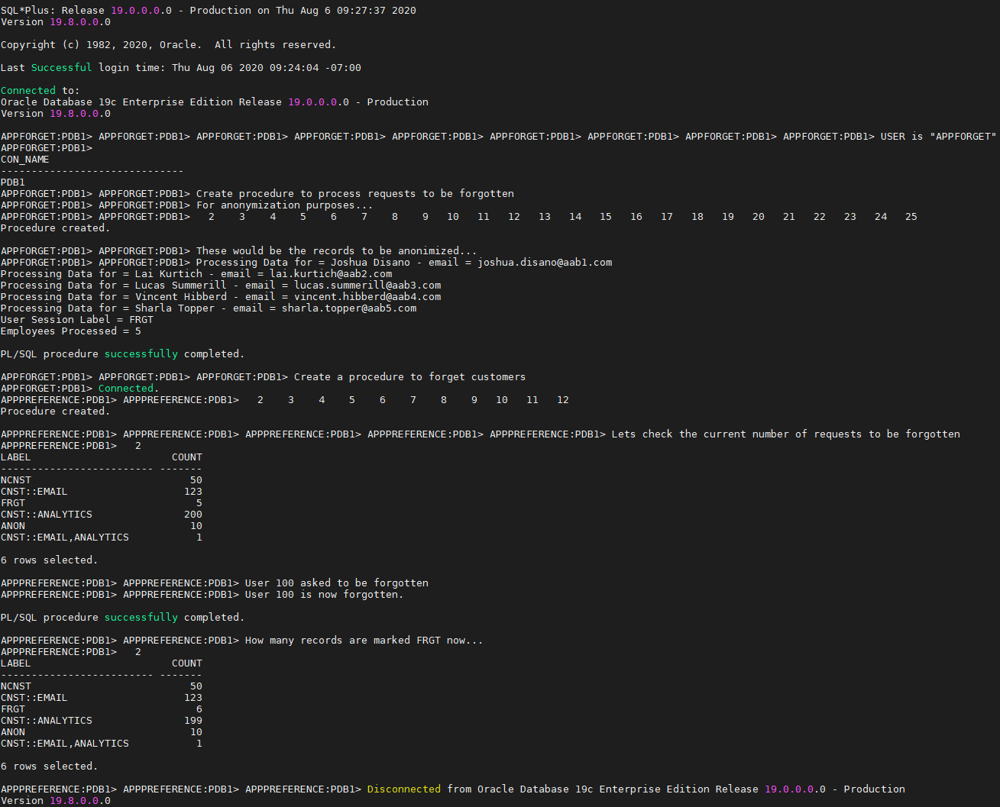

   **Note:** This script simulates an app that would process records marked to be forgotten. It creates a stored procedure to show records marked to be Forgotten (labeled FRGT::). It also creates a procedure under an AppPreference app schema that would serve the purpose of forgetting a certain customer. AppPreference can access all data and *`forget_me(p_id)`* procedure will label a certain customerid row FRGT:: “moving” a record from Consent to Forgotten.

8. Finally, we can clean up the environment (drops the OLS policy and users)

      ````
      <copy>./06_clean_env.sh</copy>
      ````

   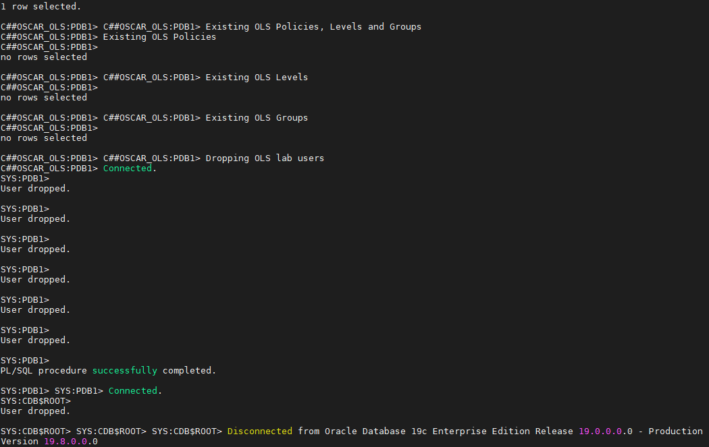

## **STEP 2**: Protect Glassfish Application

1. Open a SSH session on your DBSec-Lab VM as Oracle User

      ````
      <copy>sudo su - oracle</copy>
      ````

2. Go to the scripts directory

      ````
      <copy>cd $DBSEC_HOME/workshops/Database_Security_Labs/Label_Security/Protect_Glassfish_App</copy>
      ````

3. First, starts the infrastructure and makes sure you don't already have the OLS changes deployed to the application

      ````
      <copy>./00_start_infrastructure.sh</copy>
      ````

   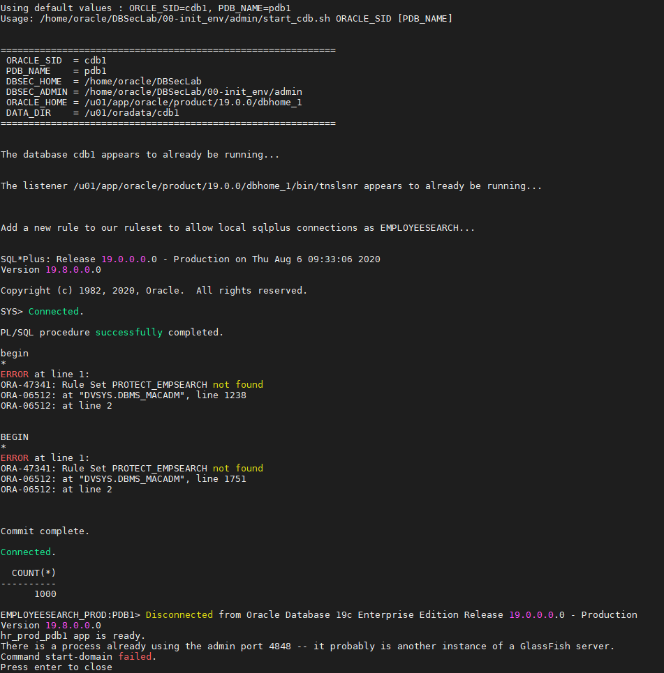

   Press [**Enter**] to close

4. Next, setup the OLS environment

      ````
      <copy>./01_setup_ols_environment.sh</copy>
      ````

   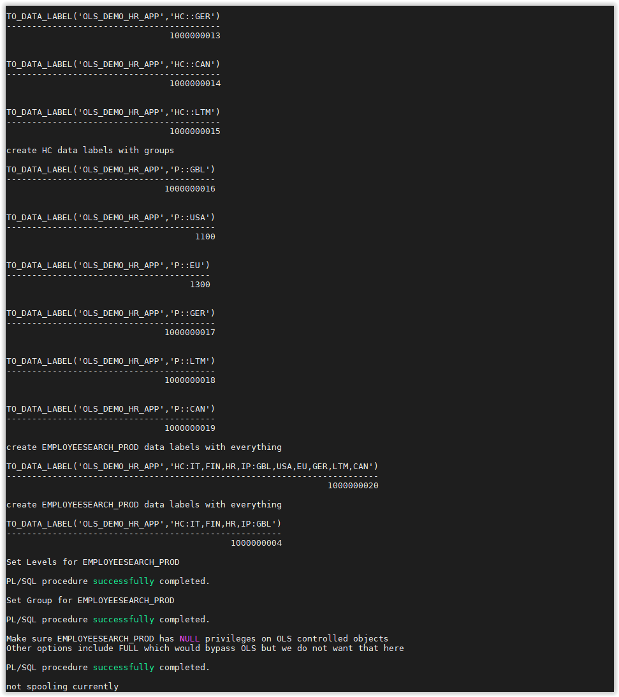

   **Note:** This script creates the OLS policy named *`OLS_DEMO_HR_APP`* as well as the levels (Public, Confidential, Highly Confidential), compartments (HR, FIN, IP, IT) and the OLS groups (GLOBAL, USA, CANADA, EU, GERMAN, LATAM).  This script also generates the data labels that will be used. This allows us to assign the numbers to our *`label_tag`* we want to have.

5. Create `EMPLOYEESEARCH_APP`

      ````
      <copy>./02_configure_employeesearch_app.sh</copy>
      ````

   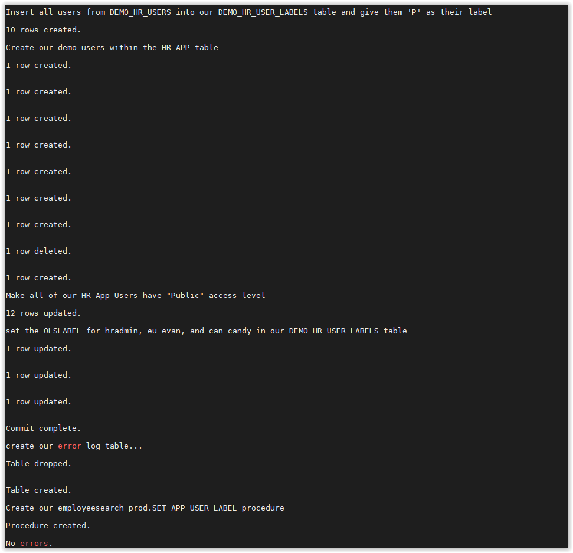

   **Note:** This script will create a custom table for the Application User Labels, *`EMPLOYEESEARCH_PROD.DEMO_HR_USER_LABELS`*, and populate it with all of the rows from *`EMPLOYEESEARCH_PROD.DEMO_HR_USERS`*.  The script will also create a few additional users we will use in this exercise, such as CAN_CANDY, EU_EVAN, and then grant the appropriate OLS User Labels to all of the Application Users.

6. Open a web browser and launch the Glassfish app by navigating to this URL:

   *http://&lt;YOUR\_DBSEC-LAB\_VM\_PUBLIC\_IP&gt;:8080/hr\_prod\_pdb1*

7. Login to the application as `can_candy` / `Oracle123`

8. Select "**Search Employees**" and click [**Search**]
   See the result before enabling OLS policy

   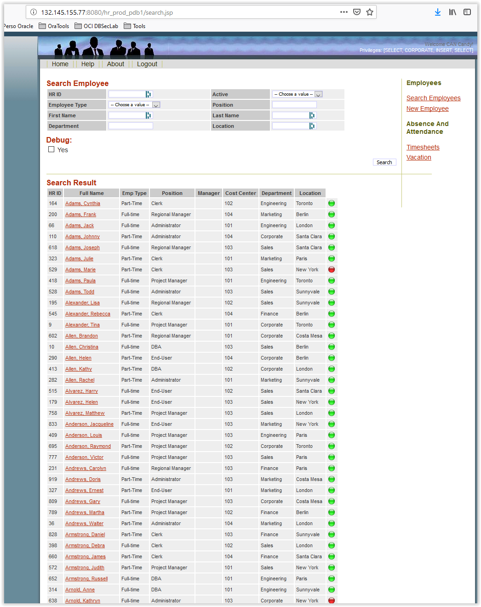

9. Logout and do the same thing as `eu_evan` / `Oracle123`

   

   **Note**: You can see all employees data with no geographic restriction

10. Go back to your terminal session and apply the OLS policy to the *`EMPLOYEESEARCH_PROD.DEMO_HR_EMPLOYEES`* table

    ````
    <copy></copy>
    ````

	

	**Note:** Once an OLS policy is applied to a table, only users with authorized labels, or OLS privileges, can see data.

	---

11. Now, update *`EMPLOYEESEARCH_PROD.DEMO_HR_EMPLOYEES`* table to populate the `olslabel` column with the appropriate OLS numeric label

    ````
    <copy>./04_set_row_labels.sh</copy>
    ````

    

    **Note:** We will dot his based on the `location` column in the table. For example, 'German' or 'Berlin' will receive an OLS label of 'P::GER' because they belong to the GERMANY group.

12. See what policy output looks like...

      ````
      <copy>./05_verify_our_policy.sh</copy>
      ````

    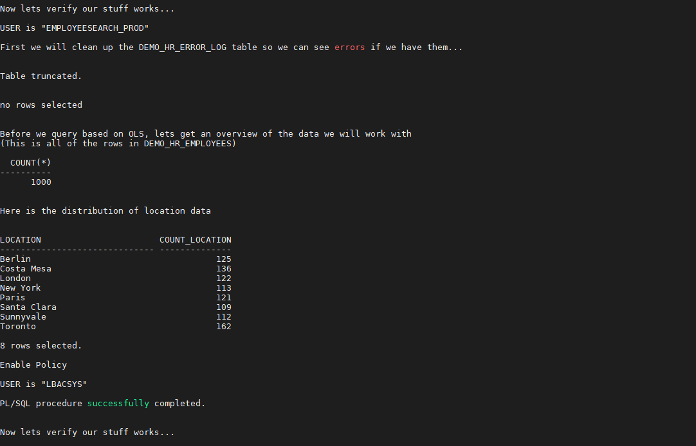

    ...and go through the data to demonstrate the different data labels and how they are displayed based on the "application user" that is accessing it:

    - for the DB USer, and schema owner *`EMPLOYEESEARCH_PROD`*

    

	- for the App User `HRADMIN`

    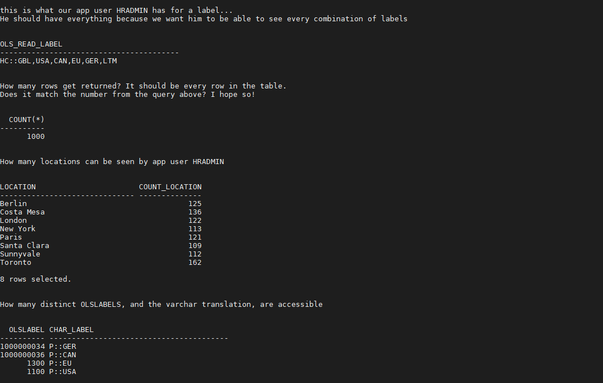

    - for the App User `EU_EVAN`

    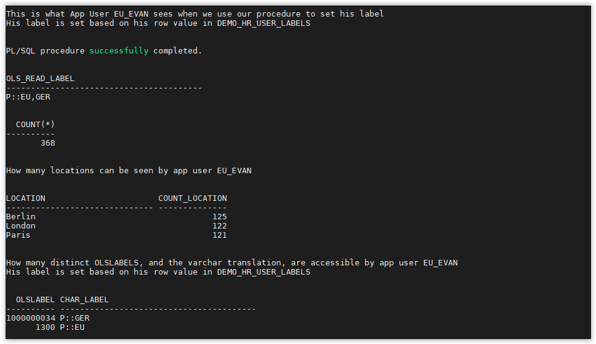

    - for the App User `CAN_CANDY`

    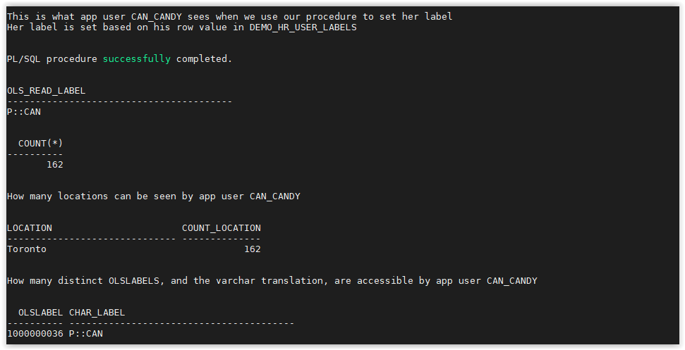

13. Finally, we make changes to the Glassfish JSP files.
    This script will step you through all of the additions we need to make

      ````
      <copy>./06_Update_Glassfish_app.sh</copy>
      ````

    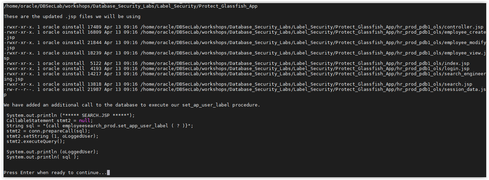

    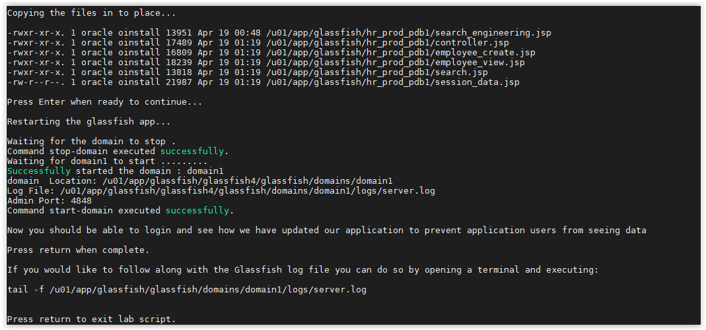

14. Go back to your web browser and launch the Glassfish app by navigating to this URL:

    *http://&lt;YOUR\_DBSEC-LAB\_VM\_PUBLIC\_IP&gt;:8080/hr\_prod\_pdb1*

15. Login to the application as `can_candy` / `Oracle123`

    - Select "**Search Employees**" and click [**Search**]

	- See the result after enabling OLS policy

    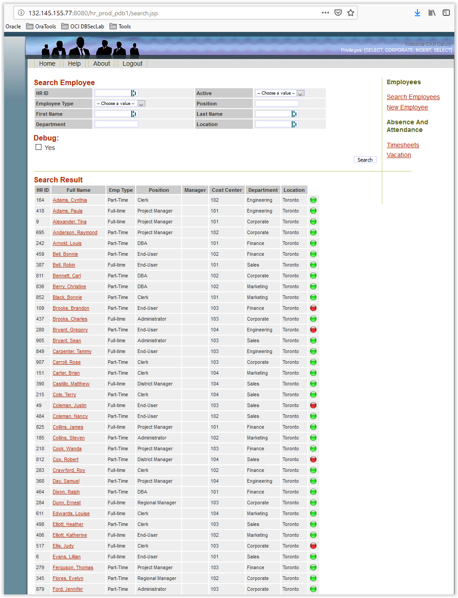

    - Logout and do the same thing as `eu_evan` / `Oracle123`

    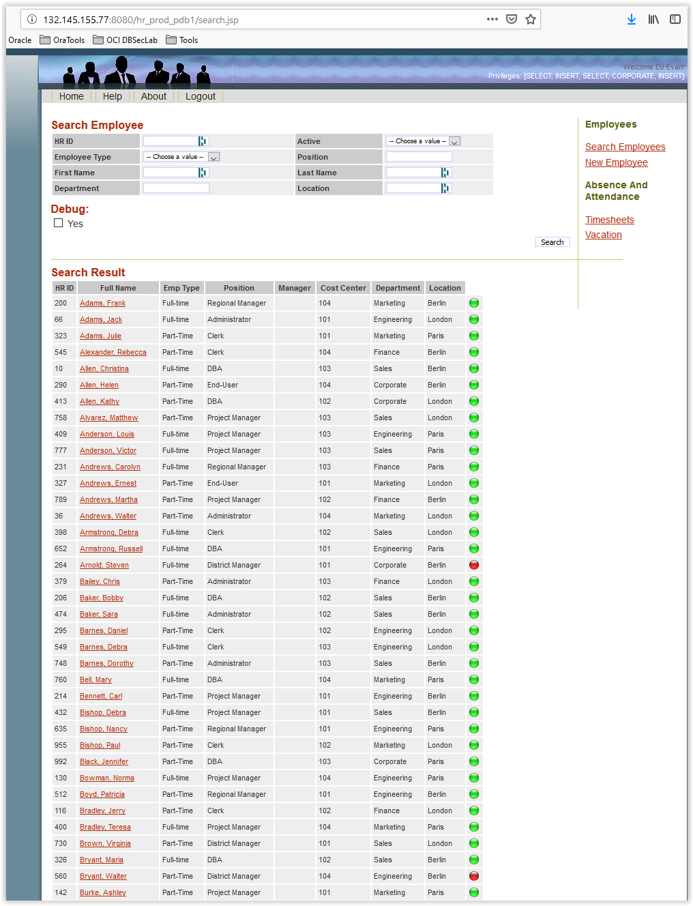

    **Note**: Now, you will see there is a difference from before. `can_candy` can only see Canadian-labeled users and `eu_evan` can only see EU-labeled users!

16. When you have completed the lab, you can remove the policies and restore the Glassfish JSP files to their original state

    ````
    <copy>./09_Remove_Policies_and_Restore.sh</copy>
    ````

    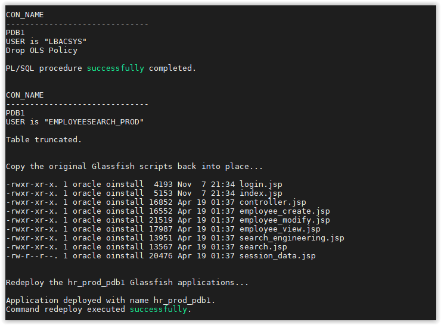

## Acknowledgements
- **Author** - Hakim Loumi, Database Security PM
- **Contributors** - Gian Sartor, Rene Fontcha
- **Last Updated By/Date** - Rene Fontcha, Master Principal Solutions Architect, NA Technology, September 2020

## See an issue?
Please submit feedback using this [form](https://apexapps.oracle.com/pls/apex/f?p=133:1:::::P1_FEEDBACK:1). Please include the *workshop name*, *lab* and *step* in your request.  If you don't see the workshop name listed, please enter it manually. If you would like for us to follow up with you, enter your email in the *Feedback Comments* section.
